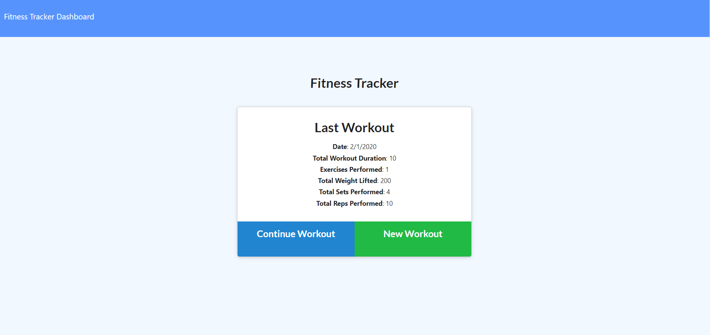
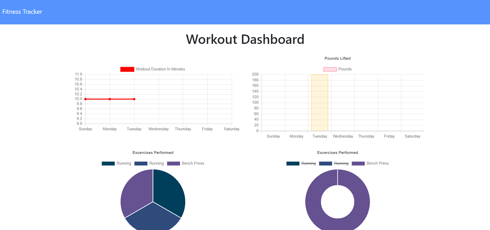

# WorkoutApp

# Project Title
Workout - As a user, I want to be able to view create and track daily workouts. I want to be able to log multiple exercises in a workout on a given day. I should also be able to track the name, type, weight, sets, reps, and duration of exercise. If the exercise is a cardio exercise, I should be able to track my distance traveled.. 

# Built With
>Html - UI features  
>CSS - Style sheet  
>Node JS 
>Express 
>Javascript 
>Mongodb 

# Versioning 
> Github

# Screenshots

# Repo Details 
https://github.com/baredh821/WorkoutApp

# Server Deployed
https://workoutappnew.herokuapp.com/

